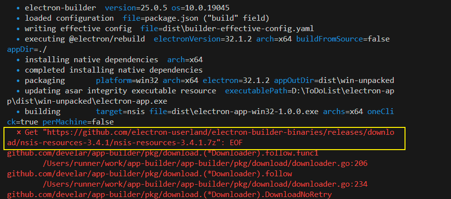
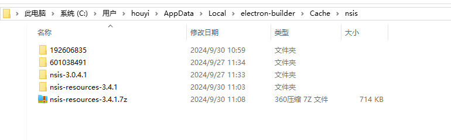

<!--
 * @Author: yeyu98
 * @Date: 2024-09-26 14:16:03
 * @LastEditors: yeyu98
 * @LastEditTime: 2024-10-04 10:57:22
 * @FilePath: \electron-app\README.md
 * @Description: 
-->
### 安装
pnpm i electron --save-dev
需要指定一下electron镜像源 
```
pnpm config set electron_mirror "https://registry.npmmirror.com/-/binary/electron/"
```

## 模块
### 生命周期
app：用于控制应用程序的生命周期；
whenReady：当electron初始化完成；
window-all-closed：关闭应用监听，一般需要在关闭应用之后退出所有的窗口 需要结合app.quit（window/linux）（难道默认关闭应用的时候不会退出窗口，窗口还在内存中？）;


### 窗口
BrowserView：浏览器窗口相当于一个webview；


### 进程
主进程是一个拥有所有操作系统权限的nodejs环境；
为了安全考虑页面的渲染只能放置在渲染进程中，
渲染进程是一个专门用来渲染界面的进程由于沙盒化进程的存在，渲染进程无法与主进程一样存在于nodejs环境中，
需要通过ipc来对主进程和不同的渲染进程之间通信，调用主进程中的一些能力；


preload脚本
主进程和渲染进程的粘合剂，由于沙盒化的存在，只拥有半残的nodejs能力（部分nodejs的能力）；
会在渲染器加载网页之前注入（注入到渲染器里相当于给渲染器添加了类似`.env`的全局配置变量只不过是从主进程里取的）；

ipc通信
由于渲染器无法直接调用主进程的能力，因此需要通过在主进程和preload中调用ipc进行进程之间的通信；
ipcMain：向渲染器发送信息；
ipcRenderer：注册主进程中的方法；

单向通信 （可能目前理解的还不够深暂时先放一下） 渲染进程 --->>> 主进程
ipcRenderer.send
ipcMain.on

双向通信（文档说是双向的但我感觉更像是单向的...可能目前理解的还不够深  暂时先放一下） 主进程 --->>> 渲染进程
在主进程中调用 ipcMain.handle('xxx', () => {})
在preload中使用 ipcRenderer.invoke('xxx') 向渲染进程中注入
渲染进程中调用 window.xxx


### 开发
热更新引入插件`electron-reloader`并定义`index.js`，在入口文件中引入即可
```
try {
  require('electron-reloader')(module)
}catch(err) {
  console.log(err)
}
```


### 调试
使用vscode调试主进程
https://www.electron.js.cn/docs/latest/tutorial/debugging-vscode


### 打包
这里打包的技术选型使用的是electron-builder
在使用electron-builder打包的时候出现了如下问题，其本质上是因为网络问题导致github上的东西无法下载成功


解决方法是：手动点击这个链接，手动下载压缩包放到 C:\Users\houyi\AppData\Local\electron-builder\Cache\nsis 目录下解压即可




### 过一下官网示例

#### Dark Mode

浏览器内使用 媒体查询属性 `prefers-color-scheme` 实现，以下代码等同于当系统指定的light呈现以下样式...
```
@media (prefers-color-scheme: light) {

}
```

```
@media (prefers-color-scheme: dark) {
  
}
```
`color-scheme`：允许元素手动指示它可以舒适地呈现哪些颜色方案。

### 快捷键
#### 本地快捷键
注册快捷键需要依托menu注册且需要在应用被聚焦时才会触发；
#### 全局快捷键
注册全局快捷键需要等待app ready之后通过globalShortcut注册，无需聚焦也会触发，比如应用被隐藏时；
